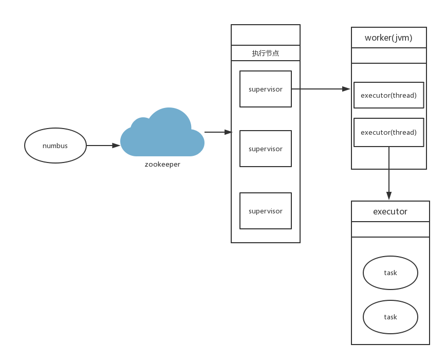
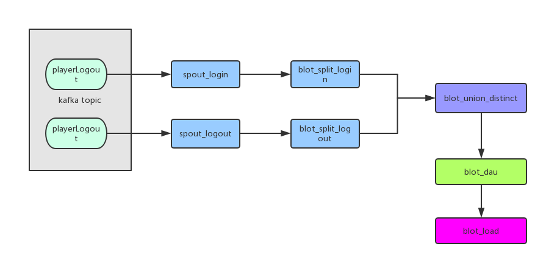
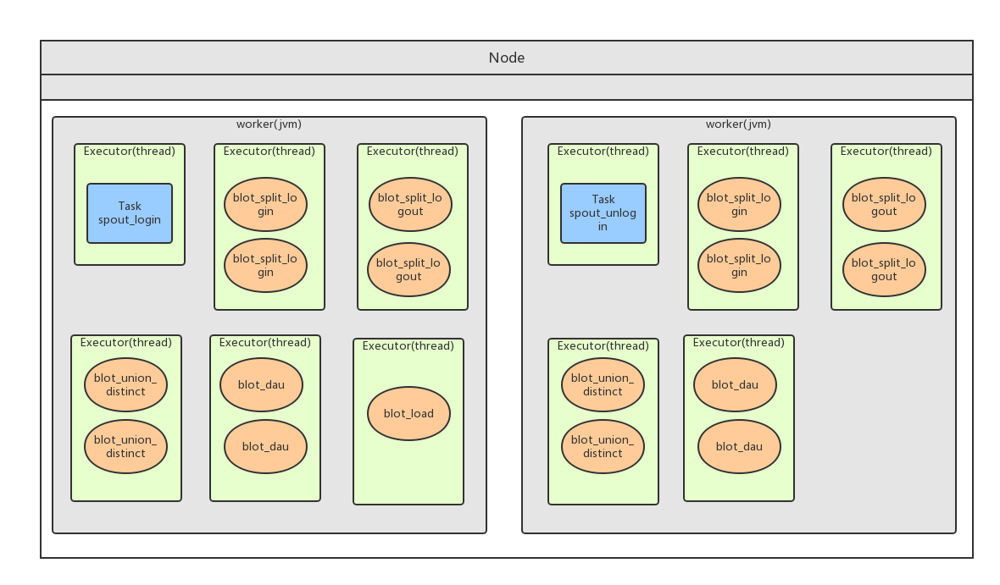

storm 学习总结
---

## 一，结构简介



### 1, numbus 进程

numbus守护进程，管理，协调，监控集群上运行的topology，包含发布任务，指派任务，失败重发。

### 2, supervistor 进程
supervistor 守护进程，等待numbus分配任务后生产并监控worker(jvm进程)。supervistor和worker运行在不同的jvm上，如果worker奔溃退出，supervistor会尝试重新恢复次进程。

### 3, worker 进程
在supervistor服务器上单独运行的jvm进程，一个topology会被分配给一个或多个worker 进行处理。

### 4, executor 
executor 指一个 worker 的jvm 进程中运行的 Java 线程。多个 task 可以指派给同一个 executer 来执行。除非是明确指定， Storm 默认会给每个 executor 分配一个 task。 一个worker上，可以启动多个executor去处理，task任务。

### 5,task
task 是最小单位，spout与blot任务的一个实例

## 二，依赖环境

- 操作系统：Centos6.5
- storm版本：apache-storm-1.0.3
- jdk版本：1.7.0_121
- zookeeper版本：zookeeper-3.4.10
- jdk版本：1.7.0_121
- kafka版本：kafka_2.10-0.8.2.1

## 三，实现dau统计

### 1, 业务描述
(1) 现 有用户登录，和用户登出两类登录日志,分别存储在kafka playerLogin主题和playerLogout主题中。首先需要我们将两类日志合并，因为都属于用户的活跃日志。

(2) 合并日志后，根据 平台+区服+vip等级分组，统计总的活跃用户数。

### 2,实现逻辑


(1) playerLogin是kafka的登录日志主题，playerLogout是kafka的登出日志主题。

(2) 使用spout\_login 消费 playerLogin主题，使用spout\_logout 消费 playerLogout主题。

(3) 使用blot\_split\_login 将接收到的登录日志，解析成对象，并从这里面挑选需要的信息发射到下一个blot做处理。blot\_split\_logout同理，解析登出日志并发射。

(4) blot\_union\_distinct 将接收到的用户信息，进行缓存。根据 (游戏+平台+区服+level+uid) md5 作为key，将用户信息进行缓存，并去重用户多余登录信息。将去重后的用户信息发射到blot\_dau。

(5) blot\_dau 根据 (游戏+平台+区服+level)作为key，统计每个区服下相同等级用户的数量。将统计信息发射到 blot\_load 进行入库处理。


### 3,名词解释

(1) spout 

    spout是程序数据入口，充当数据采集器的角色，简介到数据将数据转化为tuple发射出去。一般都可以复用。  
    
(2) blot
     
    blot 是计算程序中的运算或者函数，将一个或者多个数据流作为输入。blot 可以订阅多个spout或者blot发射的数据流。 
     
(3) tuple

    blot数据流入的单位，既一条数据的流向被称作一个blot。

(4) topology
     
    topology 整个程序作为一个整体，被称作topology.类似上图的dau计算，整个被称之为一个topology任务。
    
### 4，topology 任务配置

(1) 代码划分

```
String zkStr = "localhost:2181/kafka";

	public DauRunner(boolean is_debug, String zkStr) {
		this.is_debug = is_debug;
		if (!is_debug) {
			this.zkStr = zkStr;
		}
	}

	// kafka topic name
	final String TOPIC_LOGIN = "playerLogin";
	final String TOPIC_LOGOUT = "playerLogout";
	// spout name
	final String SPOUT_LOGIN = "spout_login";
	final String SPOUT_LOGOUT = "spout_logout";
	// blot split name
	final String BLOT_SPLIT_LOGIN = "blot_split_login";
	final String BLOT_SPLIT_LOGOUT = "blot_split_logout";
	// topology name
	final String TOPOLOGY_NAME = "dau_topic_top";
	// distinct openid blot
	final String BLOT_UNION = "blot_union_distinct";

	final String BLOT_DAU = "blot_dau";
	final String BLOT_LOADDATA = "blot_load";

	@Override
	public void run() {
		TopologyBuilder builder = new TopologyBuilder();
		// 设置登录信息spout
		builder.setSpout(SPOUT_LOGIN, new KafkaSpout(spoutConf(TOPIC_LOGIN, zkStr, is_debug)));
		builder.setBolt(BLOT_SPLIT_LOGIN, new PlayerLoginSplitBlot(), 2).setNumTasks(4).shuffleGrouping(SPOUT_LOGIN);
		// 设置登出spout
		builder.setSpout(SPOUT_LOGOUT, new KafkaSpout(spoutConf(TOPIC_LOGOUT, zkStr, is_debug)));
		builder.setBolt(BLOT_SPLIT_LOGOUT, new PlayerLogoutSplitBlot(), 2).setNumTasks(4).shuffleGrouping(SPOUT_LOGOUT);
		// union login 和logout信息,并去重用户。保证相同的用户发到同一个blot
		builder.setBolt(BLOT_UNION, new DistinctVopIdBlot(), 2).setNumTasks(4)
				.fieldsGrouping(BLOT_SPLIT_LOGIN, new Fields("dt", "game", "platform", "gamesvrid", "viplevel", "vopenid"))
				.fieldsGrouping(BLOT_SPLIT_LOGOUT, new Fields("dt", "game", "platform", "gamesvrid", "viplevel", "vopenid"));
		// dau 聚合blot，缓存每个区服下的dua总数
		builder.setBolt(BLOT_DAU, new PlatformDistVopidCountBlot(), 2).setNumTasks(4)
				.fieldsGrouping(BLOT_UNION, new Fields("dt", "game", "platform", "gamesvrid", "viplevel"));
		// // 入库blot，将数据更新至数据库
		builder.setBolt(BLOT_LOADDATA, new PlatFormDistActiveUserBolt(), 1).setNumTasks(1).globalGrouping(BLOT_DAU);

		if (is_debug) {
			LocalCluster cluster = new LocalCluster();
			cluster.submitTopology(TOPOLOGY_NAME, blotConf(), builder.createTopology());
			Utils.sleep(30 * 60 * 1000);
			cluster.killTopology(TOPOLOGY_NAME);
			cluster.shutdown();
		} else {
			Config conf = blotConf();
			conf.setDebug(true);
			conf.setNumWorkers(2);
			try {
				StormSubmitter.submitTopology(TOPOLOGY_NAME, conf, builder.createTopology());
			} catch (Exception e) {
				e.printStackTrace();
			}
		}
	}
```

(1) spout\_login 与 spout\_logout 设置任务数为1，执行线程数为1。

(2) blot\_split\_login 与 blot\_split\_logout 设置2个线程执行，每个线程执行2个任务。

(3) blot\_union\_distinct 设置2个线程执行，每个线程执行2个任务。

(4) blot\_dau 设置2个线程执行，每个线程执行2个任务。

(5) blot\_load 设置1个线程执行，任务数为1。


下面是单节点执行任务费配图：



### 5，storm 分组介绍

(1), shuffleGrouping

将流分组定义为混排。这种混排分组意味着来自Spout的输入将混排，或随机分发给此Bolt中的任务。shuffle grouping对各个task的tuple分配的比较均匀。

(2), fieldsGrouping

这种grouping机制保证相同field值的tuple会去同一个task，这对于WordCount来说非常关键，如果同一个单词不去同一个task，那么统计出来的单词次数就不对了。

(3), All grouping

广播发送， 对于每一个tuple将会复制到每一个bolt中处理。

(4), Global grouping

Stream中的所有的tuple都会发送给同一个bolt任务处理，所有的tuple将会发送给拥有最小task_id的bolt任务处理。

(5), None grouping

不关注并行处理负载均衡策略时使用该方式，目前等同于shuffle grouping,另外storm将会把bolt任务和他的上游提供数据的任务安排在同一个线程下。

(6), Direct grouping

由tuple的发射单元直接决定tuple将发射给那个bolt，一般情况下是由接收tuple的bolt决定接收哪个bolt发射的Tuple。这是一种比较特别的分组方法，用这种分组意味着消息的发送者指定由消息接收者的哪个task处理这个消息。 只有被声明为Direct Stream的消息流可以声明这种分组方法。而且这种消息tuple必须使用emitDirect方法来发射。消息处理者可以通过TopologyContext来获取处理它的消息的taskid (OutputCollector.emit方法也会返回taskid)


##### 关联业务：
    . blot_split_login和 blot_split_logout,我们使用shuffleGrouping,将数据平均分配出去。
    . blot_union_distinct 和 blot_dau,我们使用fieldsGrouping，通过 游戏+平台+区服+level将信息进行分组。保证相同用户的信息都能进入同一个blot进行处理。
    . blot_load 我们使用 Global grouping 分组，将所有统计后的信息发射到同一个blot进行入库.防止更改信息时锁表。

###6, 本地调试和集群运行
    
#### 本地调试
    . 使用debug模式，运行com.playcrab.storm.demo.TopologyRunner类,传入参数 true 127.0.0.1:2181/kafka.
    . 启动com.playcrab.kafka.SentMsg 类，将信息存储到kafka主题中。

#### 集群运行
     . 在numbus上执行命令, ${storm_home}/storm jar storm-demo-0.0.1-SNAPSHOT.jar 
     com.playcrab.storm.demo.TopologyRunner  
     false 
     172.16.8.152,172.16.8.153,172.16.8.154:2181/kafkaa

    
### 关于事例代码
    
    . 为什么没有使用TridentTopology ? 使用中发现并没有想象中强大，而且封装的也不是很友好，不好理解也不易于维护。
    . TODO ，有功夫的话，会使用redis作为缓存方案，不会直接用java的数据结构。
    
### 关于storm的理解

    . 它并不适合做中间数据清洗层，代码编写量巨大，且缓存信息操作过多。
    . 不适合做过多的数据指标，或者多维度统计，也是一样的原因。写的过多不易于维护和代码编写。
    . 适合做简单的，重要指标的实时统计，且维度固定。


